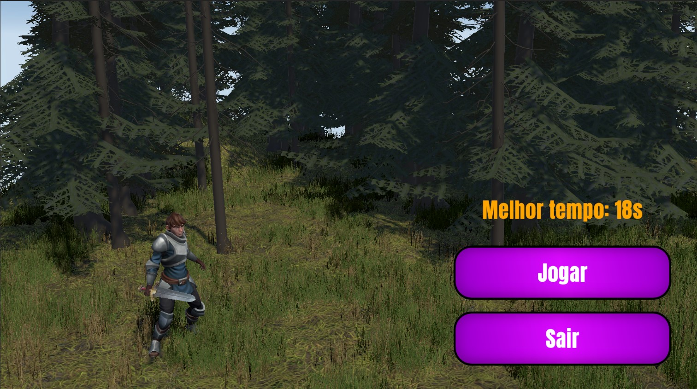
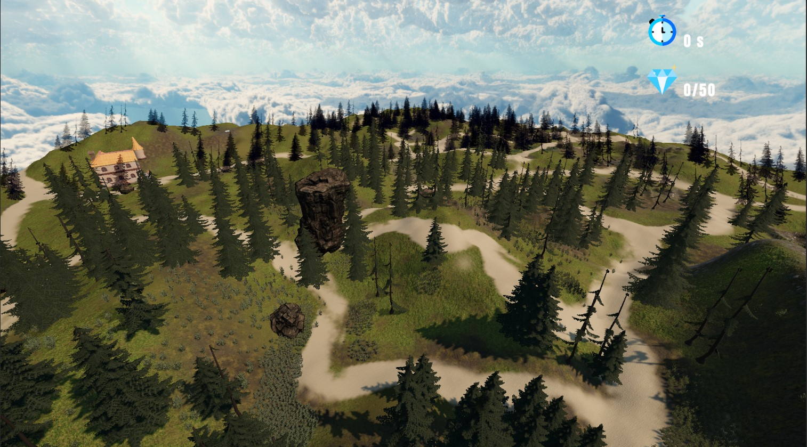
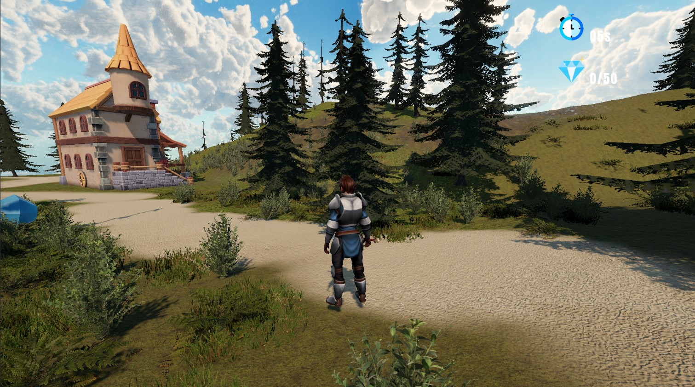
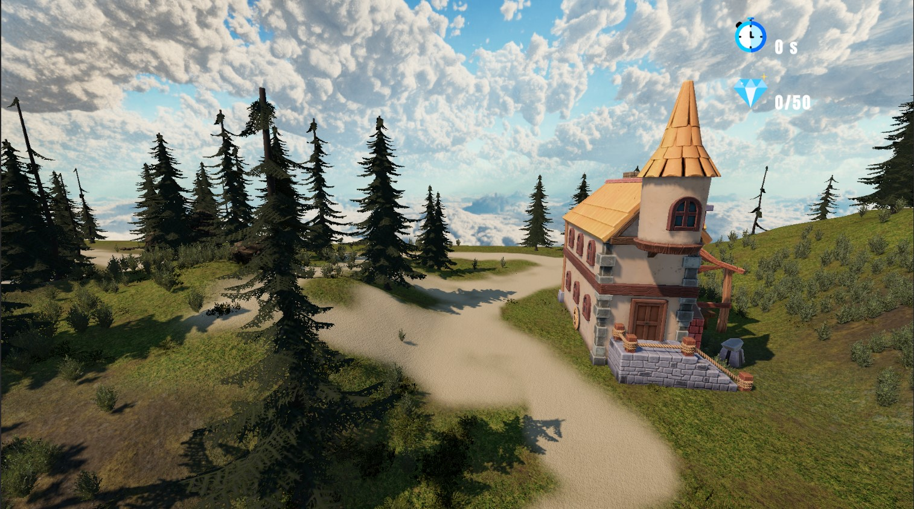
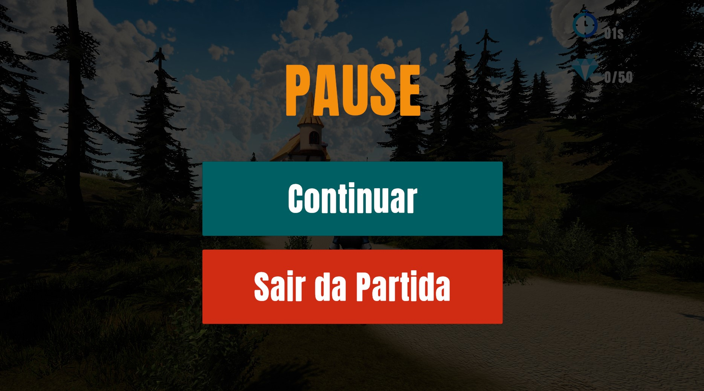

# Explorador

Projeto desenvolvido em Unity como parte dos meus estudos em desenvolvimento de jogos, programação em C# e versionamento com Git e GitHub.

## Vídeo Demonstrativo

🎥 Demonstração completa do projeto:

https://youtu.be/piNbAkGrUDU

## Sobre o Projeto

**Explorador** é um jogo 3D de exploração desenvolvido na Unity.

O jogador percorre um cenário montanhoso acima das nuvens, explorando florestas, caminhos e construções enquanto procura diamantes espalhados pelo mapa.

O objetivo é coletar os **50 diamantes** no menor tempo possível, registrando seu melhor desempenho.

## Capturas de Tela

### Tela Inicial

### Visão Geral do Mapa

### Exploração do Cenário

### Casa do Cenário

### Menu Pausa

## Funcionalidades

* Movimentação do personagem em terceira pessoa
* Sistema de câmera acompanhando o jogador
* Coleta de diamantes
* Contador de itens coletados
* Cronômetro de tempo
* Registro do melhor tempo obtido
* Interface gráfica (HUD)
* Menu inicial com opções de jogo
* Cenário 3D explorável

## Novas funcionalidades

- Implementação de câmera em terceira pessoa acompanhando a direção do personagem
- Sistema de sons de passos sincronizados com a movimentação
- Tela de pausa (Pause Menu)
- Opção de continuar o jogo
- Opção de retornar ao menu principal
- Opção de encerrar o jogo

## Melhorias recentes

- Correção do comportamento da câmera
- Ajuste do Character Controller para alinhamento correto ao terreno
- Correção dos efeitos sonoros de passos
- Implementação do sistema de pausa e encerramento do jogo
- Melhorias na experiência de navegação entre cenas

## Tecnologias Utilizadas

* Unity 6
* C#
* Git
* GitHub

## Formação Utilizada

Projeto desenvolvido durante os estudos realizados na:

* Academia do Desenvolvedor Unity
* https://academy.desenvolvedorunity.com.br/

## O Que Aprendi

Durante o desenvolvimento deste projeto pratiquei:

* Programação orientada a objetos em C#
* Utilização do Character Controller
* Manipulação de colisões e gatilhos (Triggers)
* Sistema de coleta de objetos
* Desenvolvimento de interfaces (UI)
* Controle de câmera em terceira pessoa
* Organização de projetos Unity
* Versionamento de código com Git
* Publicação de projetos no GitHub

## Possíveis Melhorias Futuras

* Novos mapas e cenários
* Sistema de fases
* Efeitos sonoros adicionais
* Sistema de salvamento de progresso
* Novos objetivos e desafios

## Desenvolvido por

**Susi Funghetti | Unity & QA**

Canal no YouTube:
https://www.youtube.com/@SusiFunghettiUnityQA

## Observação

Este projeto foi desenvolvido para fins de estudo e aprimoramento das minhas habilidades em desenvolvimento de jogos digitais, Unity e Quality Assurance (QA).
